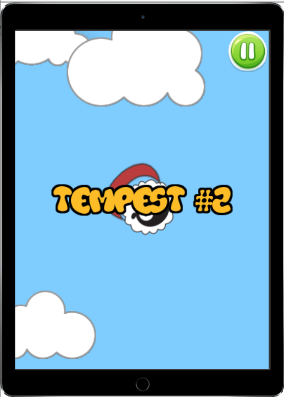

Jeronimo Game
============

This is a lua game project powered by Corona SDK when I was still studying game development

It was lost in a bitbucket repository and has now been found xD

---
## Setup

Download [Solar2d](https://solar2d.com/)

Clone this repo to your desktop and open the main file in a new project.

---
## Screen Shots

